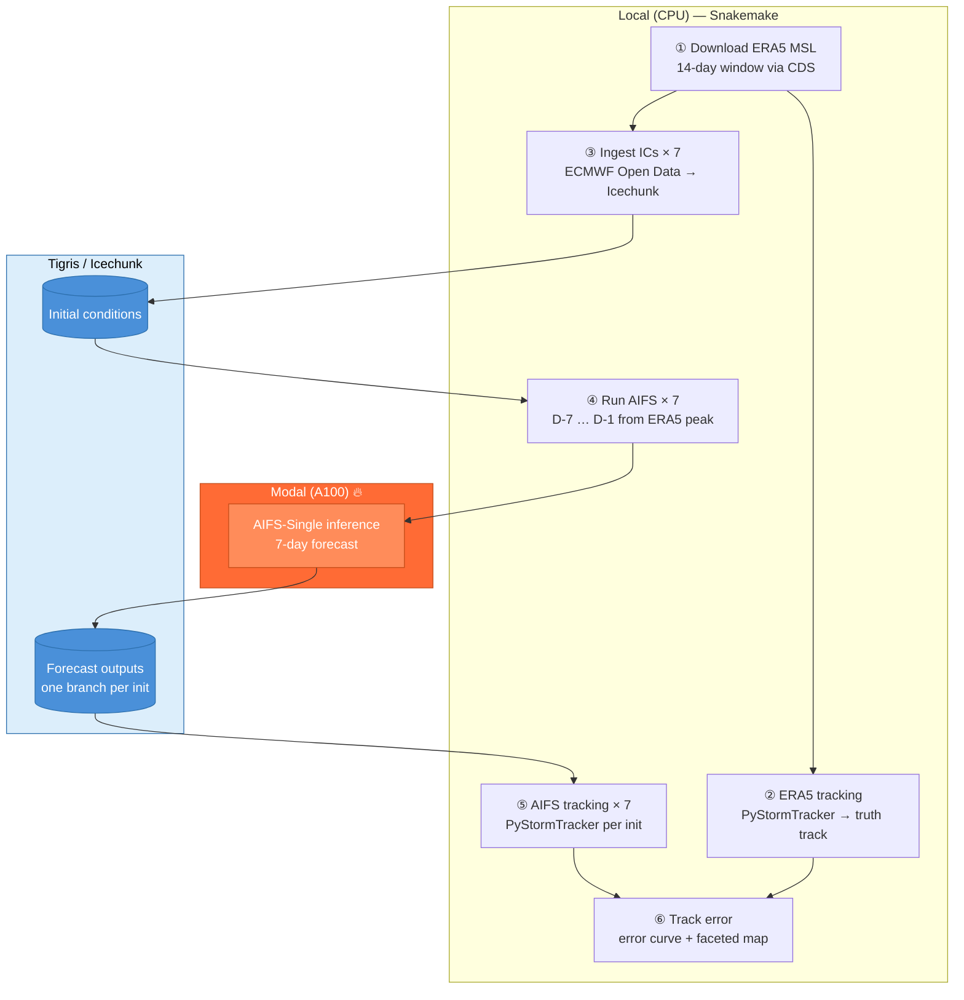

# AIFS on Modal — Storm Claudia predictability demo

Run a neural weather model (AIFS) on a serverless GPU, track a named storm
across 7 forecast horizons, and measure where the prediction goes wrong.

**Stack**: ERA5 (CDS) → icechunk/Zarr (Tigris) → AIFS (Modal A100) → PyStormTracker → Snakemake

______________________________________________________________________

## What this demo does

Storm Claudia (AEMET, 2025-11-10) was a deep Atlantic cyclone. We run AIFS
seven times — initialised D-7 through D-1 before the ERA5 intensity peak
(2025-11-08 00Z) — and ask: **how far is the predicted track from the ERA5
ground truth, at each lead time?**



______________________________________________________________________

## Prerequisites

| What                                                     | Why                     |
| -------------------------------------------------------- | ----------------------- |
| [pixi](https://pixi.sh)                                  | Reproducible Python env |
| [Modal](https://modal.com) account + `modal token new`   | GPU forecasts           |
| [Tigris](https://www.tigrisdata.com) bucket `aifs-modal` | icechunk store          |
| CDS API key (`~/.cdsapirc`)                              | ERA5 download           |
| `AWS_ACCESS_KEY_ID` / `AWS_SECRET_ACCESS_KEY` env vars   | Tigris access           |

Install the environment:

```bash
pixi install
```

______________________________________________________________________

## Run the full pipeline

```bash
pixi run snakemake data/processed/track_error_claudia.csv -j 7
```

- `-j 7` runs the 7 forecast initialisations in parallel
- `--resources kernels=2` caps concurrent Jupyter kernel starts to avoid timeouts

Outputs land in `data/processed/`:

```
track_error_claudia.csv        # per-timestep error table
track_error_claudia.png        # error vs lead-time curve
track_error_claudia_maps.png   # faceted track map (D-1 … D-7)
```

______________________________________________________________________

## Pipeline stages (live walkthrough)

### 01 — Download ERA5

`notebooks/01-download-era5.ipynb`

Downloads a 14-day window of global 6-hourly MSL at 2.5° via CDS. Global
domain is required by PyStormTracker's spherical harmonic filter.

### 02 — ERA5 storm tracking

`notebooks/02-era5-tracking.ipynb`

Runs the Hodges spectral tracker on the ERA5 field; extracts track 51 as the
Claudia ground truth.

### 03 — Ingest initial conditions

`notebooks/03-ingest-ic.ipynb`

Downloads two consecutive 6-hourly ECMWF Open Data snapshots (T−6h and T+0)
for each init date and commits them to the icechunk IC repository on Tigris.
Skipped automatically if already ingested. CPU-only, runs in parallel across
all 7 init dates.

### 03 — Run AIFS forecast on Modal

`notebooks/03-run-aifs-forecast.ipynb`

Dispatches a 7-day deterministic AIFS forecast to Modal (assumes ICs are
already ingested), then calls:

```python
with app.run():
    run_forecast.remote(
        start_date,
        storage_bucket="aifs-modal-unibe",
        lead_time=168,  # 7 days
        outputs_branch="claudia-2025110700",
    )
```

One Modal A100 job per initialisation — ~2 min, ~$0.05. Results stored in a
dedicated icechunk branch so all 7 jobs can run in parallel without conflicts.

### 04 — AIFS storm tracking

`notebooks/04-aifs-tracking.ipynb`

Opens the icechunk store, extracts MSL, saves a NetCDF, runs PyStormTracker —
same algorithm as ERA5, different data source.

### 05 — Track error

`notebooks/05-track-error.ipynb`

Matches AIFS and ERA5 tracks at shared 6-hourly timesteps, computes
great-circle distance (km), and plots:

1. **Error vs lead-time** — one line per initialisation, 300 km threshold
1. **Faceted track map** — AIFS (red) vs ERA5 (black) per lead time

______________________________________________________________________

## Repo layout

```
aifs-modal-demo/
├── Snakefile                   # 6-rule pipeline
├── pyproject.toml              # pixi workspace
├── aifs_modal_demo/            # (placeholder package)
├── notebooks/
│   ├── 01-download-era5.ipynb
│   ├── 02-era5-tracking.ipynb
│   ├── 03-ingest-ic.ipynb
│   ├── 03-run-aifs-forecast.ipynb
│   ├── 04-aifs-tracking.ipynb
│   └── 05-track-error.ipynb
└── data/
    ├── raw/                    # ERA5 MSL NetCDF
    ├── interim/                # per-init tracks CSVs, MSL NetCDFs, .done markers
    └── processed/              # final outputs (CSV + PNGs)
```

______________________________________________________________________

## Key design choices exposed

| Choice                                  | Why                                             |
| --------------------------------------- | ----------------------------------------------- |
| icechunk branch per init                | Parallel writes without conflict errors         |
| PyStormTracker on both ERA5 and AIFS    | Apples-to-apples comparison                     |
| Snakemake marker files (`*.done`)       | Track cloud outputs as local artifacts          |
| `resources: kernels=1` on forecast rule | Prevent 7 kernels starting simultaneously       |
| Haversine distance                      | Simple, exact on a sphere, no projection needed |

______________________________________________________________________

## Related

- [aifs-modal](https://github.com/martibosch/aifs-modal) — the Modal wrapper used here
- [PyStormTracker](https://github.com/martibosch/pystormtracker) — Hodges spectral tracker
- [icechunk](https://github.com/earth-mover/icechunk) — version-controlled tensor store

|                          GitHub repo                          |                          LinkedIn                          |
| :-----------------------------------------------------------: | :--------------------------------------------------------: |
|  |  |

## Acknowledgments

- Based on the [cookiecutter-data-snake :snake:](https://github.com/martibosch/cookiecutter-data-snake) template for reproducible data science.
