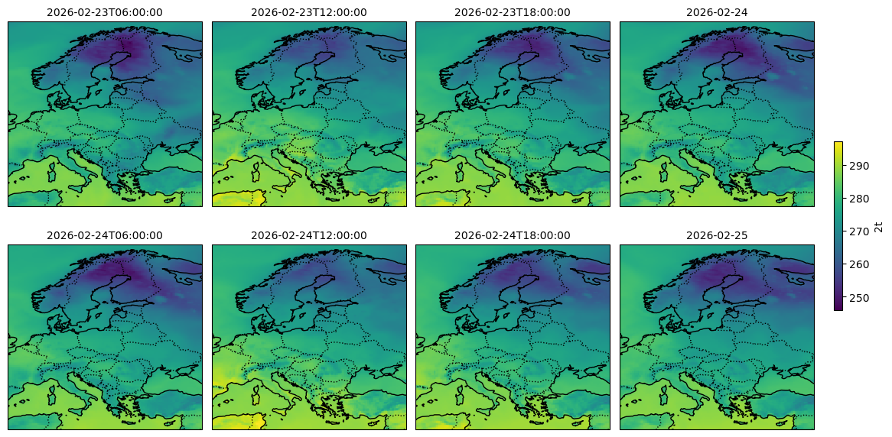

[](https://github.com/martibosch/aifs-modal-demo/blob/main/LICENSE)

# AIFS modal demo

Serverless AIFS forecasting in [modal](https://modal.com).



This set up provides a serverless approach to run AIFS forecasts, where experiments store its outputs using a git-like interface using [Icechunk](https://icechunk.io/en/stable/overview) on a S3-like bucket. This ensures that only AIFS inference happens on a GPU-enabled server[^1], whereas the post-processing can be executed in local notebooks. See:

- [a flowchart diagram](https://github.com/martibosch/aifs-modal-demo/blob/main/figures/pipeline-with-ingestion.md) illustrating this set up.
- [the canonical notebook](https://github.com/martibosch/aifs-modal-demo/blob/main/notebooks/run-aifs-modal.ipynb) on how to run serverless AIFS forecasts, both *deterministic* and *ensemble*.
- [an ensemble reforecast of the June 2025 European Heatwave](https://github.com/martibosch/aifs-modal-demo/blob/main/notebooks/heatwave-reforecast-ens.ipynb) and its evaluation using MeteoSwiss station data with [stationbench](https://github.com/juaAI/stationbench).
- [an exploration of the Northern-Hemisphere jet-stream](https://github.com/martibosch/aifs-modal-demo/blob/main/notebooks/jet-stream-free-run.ipynb) as simulated by AIFS (free-running).

## Requirements

1. A [modal](https://modal.com) account to run serverless AIFS inference. The ["Starter" plan gets you 30$/month of free credits](https://modal.com/pricing), so considering that the running the example 96 h forecast costs about 0.05$, you should be able to run about 600 of them!
2. A [Tigris storage bucket](https://www.tigrisdata.com/docs/buckets/create-bucket) to write the outputs using [Icechunk](https://icechunk.io/en/stable/overview). The ["Free Tier" gives you 5 GB of data storage per month](https://www.tigrisdata.com/pricing), which can be a bit limiting but still should let you run a few forecasts.

## Steps to run

1. Autehticate to your modal account:

```bash
pixi run modal setup
```

2. Set up your Tigris access keys as [a modal secret](https://modal.com/docs/guide/secrets) named `aws-credentials` with at least the `AWS_ACCESS_KEY_ID` and `AWS_SECRET_ACCESS_KEY` keys (and optionally `AWS_REGION`). Optionally, you can also set up another modal secret named `huggingface-secret` with at least the `HF_HUB_TOKEN` to enable faster downloads from HuggingFace Hub.

3. Run [the notebooks](https://github.com/martibosch/aifs-modal-demo/tree/main/notebooks) :rocket:!

## Acknowledgments

- This is an adaptation of the [earth-mover/aifs-demo](https://github.com/earth-mover/aifs-demo) repository to run on [modal](https://modal.com).
- The [aifs-single-1.1](https://huggingface.co/ecmwf/aifs-single-1.1) and [aifs-ens-1.0](https://huggingface.co/ecmwf/aifs-ens-1.0) models, [Anemoi](https://anemoi.readthedocs.io) framework, [ECMWF Open Data](https://www.ecmwf.int/en/forecasts/datasets/open-data) and [ERA5 reanalysis data](https://www.ecmwf.int/en/forecasts/dataset/ecmwf-reanalysis-v5) have been produced by the [European Centre for Medium-Range Weather Forecasts (ECMWF)](https://www.ecmwf.int).
- Based on the [cookiecutter-data-snake :snake:](https://github.com/martibosch/cookiecutter-data-snake) template for reproducible data science.

## Footnotes

[^1]: See [The 3 key optimizations that cut the cost of AI weather forecasts by 90%](https://earthmover.io/blog/the-3-key-optimizations-that-cut-the-cost-of-ai-weather-forecasts-by-90) for a detailed discussion.
