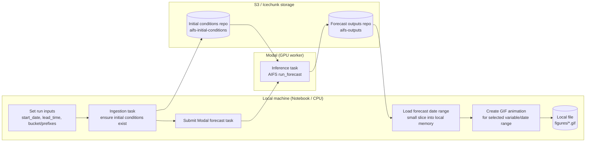

# `run-aifs-modal` Pipeline (with initial conditions ingestion)

```mermaid
flowchart LR
    subgraph L["Local machine (Notebook / CPU)"]
        A[Set run inputs<br/>start_date, lead_time, bucket/prefixes]
        B[Ingestion task<br/>ensure initial conditions exist]
        C[Submit Modal forecast task]
        D[Load forecast date range<br/>small slice into local memory]
        E[Create GIF animation<br/>for selected variable/date range]
        F[(Local file<br/>figures/*.gif)]
    end

    subgraph M["Modal (GPU worker)"]
        G[Inference task<br/>AIFS run_forecast]
    end

    subgraph S["S3 / Icechunk storage"]
        H[(Initial conditions repo<br/>aifs-initial-conditions)]
        I[(Forecast outputs repo<br/>aifs-outputs)]
    end

    A --> B --> C
    B --> H
    C --> G
    H --> G
    G --> I
    I --> D
    D --> E --> F
```
